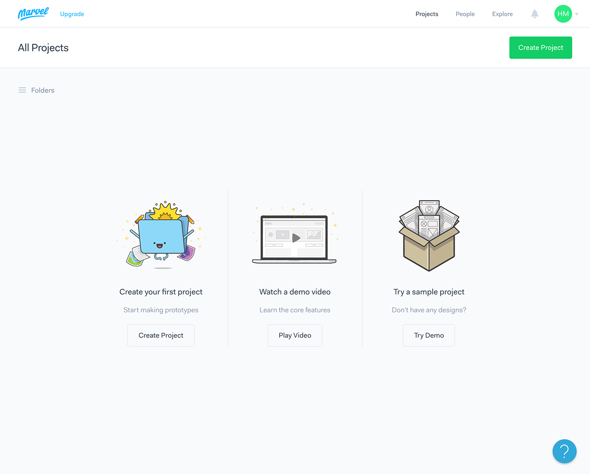

#Marvel使い方

##Marvelとは
無料で使うことができるペーパープロトタイピングツールです。  
ブラウザバージョンとアプリバージョン（iOS、Android）があります。

すでにMarvelのアカウントを取得していることを前提に進めます。

&nbsp;
&nbsp;

##サインイン

Marvelのサイトにアクセスしてください。  
[https://marvelapp.com/](https://marvelapp.com/)

右上の「Sign In」を押します。  
登録したメールアドレスとパスワードを入れてSign inします。

Create Prjectのボタンを押します。

&nbsp;
&nbsp;

##プロジェクト作成

まずプロジェクト名を入れます。  
Webサイトやアプリの名前を入れてください。

デバイスの種類を選択します。  
種類は現在、Desktop/Web、iPhone、iPad、Android、Apple Watchがあります。  
今回は、画面サイズ640x1136pxのiPhoneアプリのプロトタイプを作成するので「iPhone 5s」を選択し、Create Projectのボタンを押します。

&nbsp;
&nbsp;

##デザインのアップロード

Drop your designs here!と出るので、
ブラウザ上にGIF、JPG、PNG形式のデザイン画面をドラッグ&ドロップします。

&nbsp;
&nbsp;

##リンク領域の設定

一番最初の画面からリンクをつけていきます。  
今回はLIFE CURRYのロゴがあるスプラッシュ画面が一番初めなので、
01splashの画面にマウスカーソルを重ね、Editボタンを押します。

スプラッシュ画面には、全体にリンクを貼ります。  
ドラッグで、ブルーのリンク領域を広げてください。

領域を選択できると、下からメニューが表示されます。  

先ほど作ったリンク領域をクリックした際に遷移するページを選択します。

ここでは、オンボーディングページに遷移させたいので、02onbord1という画像をクリックします。

&nbsp;
&nbsp;

##トランジションの設定

これで遷移が1つ作成できました。  
次にスプラッシュ画面にもリンク領域をつくります。

画面上部にKeybord shortcutsという説明テキストがあります。  
実際にキーボードの→（右矢印）キーを押し、2枚目の画面に進みます。

前回の繰り返しで、またリンク領域を設定してきましょう。  
ここでは、ホーム画面トップに遷移させたいので、03topic1という画像をクリックします。

今度は、遷移のトランジション（アニメーション）をつけます。

現在タブが「Hotspot Destination」になっているので、
「Screen Transition」をクリックします。

トランジションはSlide Leftを選択します。

&nbsp;
&nbsp;

##アクションの設定

下部メニューにタブが3つありましたが、
その中に「Action」もありましたので、少しご紹介します。

クリックや、スワイプなどのインタラクションに合わせて
画面が遷移できるように設定できます。

トランジションと同じように、リンク領域を設定すると設定できるようになります。

&nbsp;
&nbsp;

##動作の確認

最後に上手く動くか、Playボタンを押してみます。  
左下のホームを押すと一番初めの画面に戻ります。

ブラウザである程度の遷移を作ることができたら、モバイル端末でも実際に動作やデザインを確認してみましょう。

スマートフォン端末にMarvelのアプリケーションをダウンロードし、先ほどブラウザでサインインしたIDと同じもので設定します。すると作成したプロジェクト名が表示され、テストができるようになります。

&nbsp;
&nbsp;

##動画でのチュートリアル

動画でも一連の操作が確認できます。  
[https://vimeo.com/78741166](https://vimeo.com/78741166)
